# sprints_tourist_guide_app

A new Flutter project.

## Overview

This project is a mobile application designed for tourists visiting Egypt. The app helps users explore landmarks, museums, and attractions across various Egyptian governorates, providing a user-friendly interface and engaging features.

## Features

1. Authentication

   - Signup Page:

     Input fields: Full Name, Email, Password, Phone Number (optional).  
      A "Signup" button navigates to the Login Page.

   - Login Page:

     Input fields: Email and Password.
     Validatesccessful login.

2. Home Page

   Suggested Places to Visit:
   Displays a grid view of recommended places.
   Popular Places Section:
   Horizontally scrollable cards with:
   Image of the place.
   Name of the place.
   Governorate name.
   A toggleable favorite icon.

3. Governments Page

   A list of three Egyptian governorates.
   Selecting a governorate navigates to a details page showing two landmarks specific to that governorate.

4. Profile Page

   Displays user information:

   - Full Name.
   - Email.
   - Password (hashed for security).

5. Favorites Page

   Displays static cards similar to the "Popular Places" section from the Home Page.

6. Navigation

   Bottom Navigation Bar visible on all main pages:
   Includes icons for Home, Governments, Favorites, and Profile.

7. Page Navigation Animations

   Smooth animations when transitioning between pages.

## Dependencies

1. fluttertoast: ^8.2.10
2. easy_localization: ^3.0.7
3. country_flags: ^3.2.0
4. provider: ^6.1.2
5. lottie: ^3.3.0
6. shared_preferences: ^2.3.5
7. cupertino_icons: ^1.0.8

## 📸 Screens

    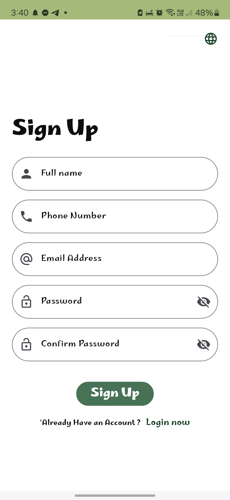
    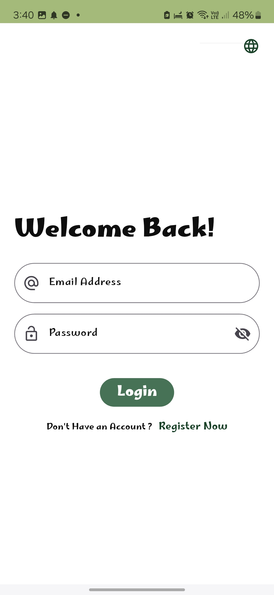
    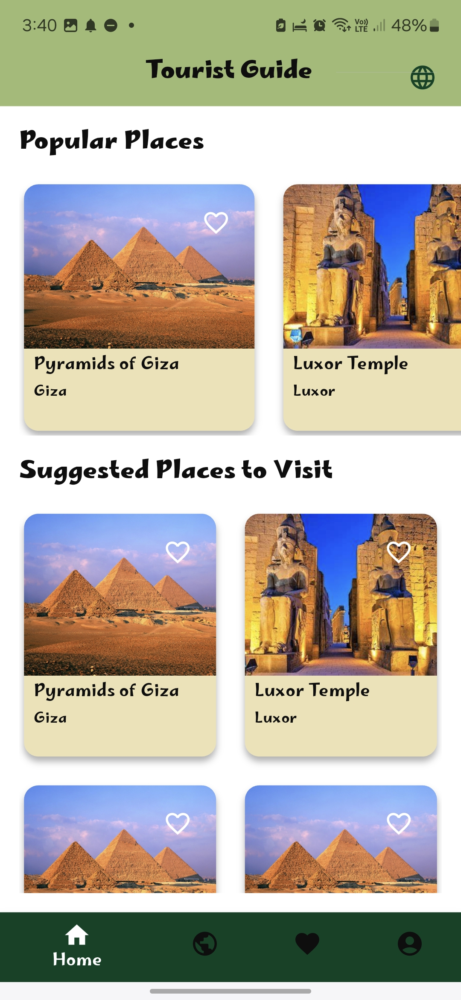
    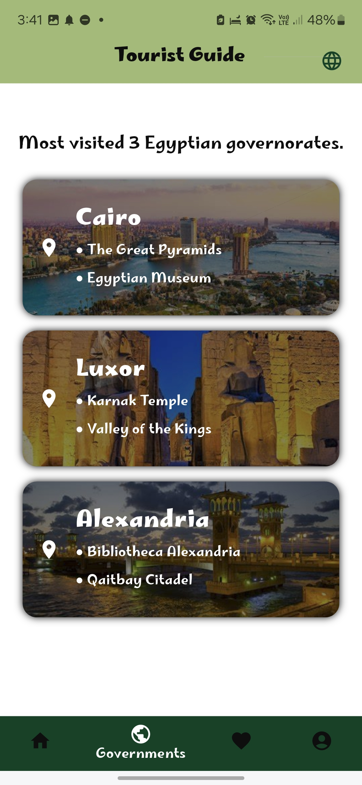

    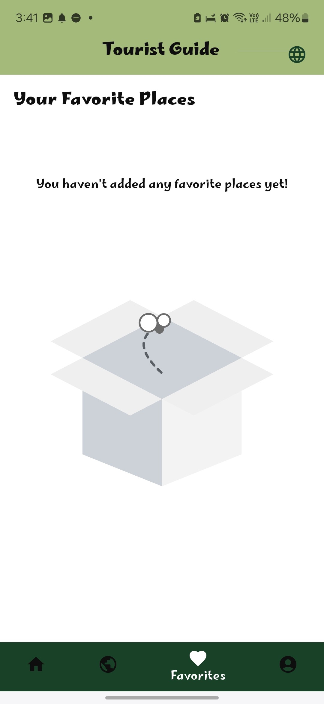
    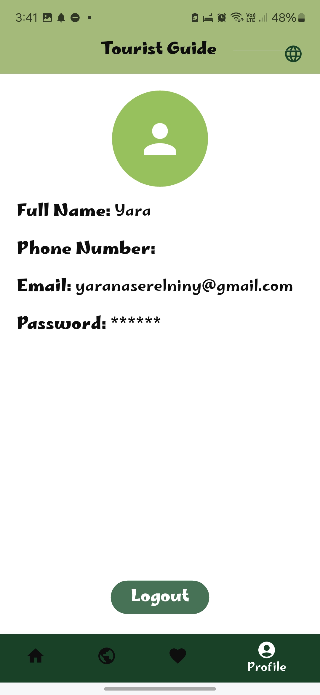
    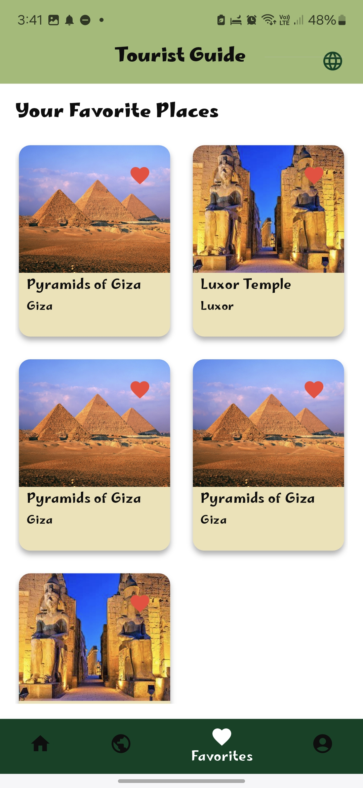
    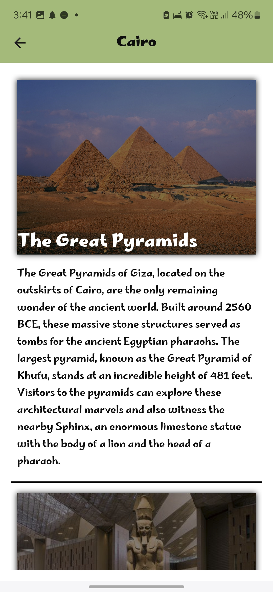

    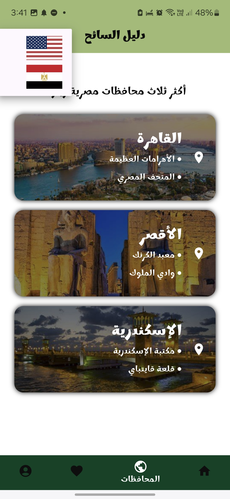
    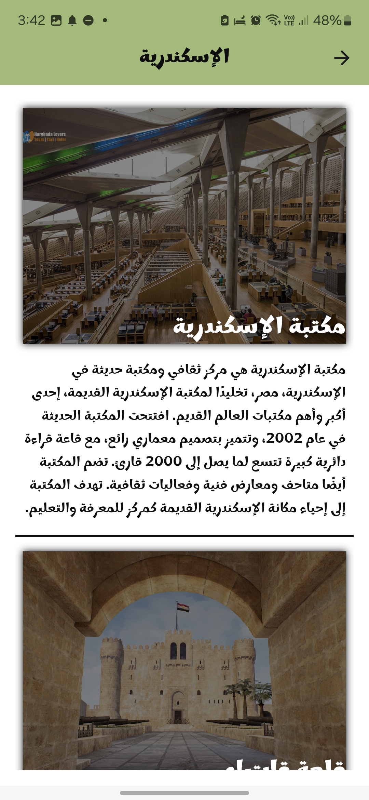
    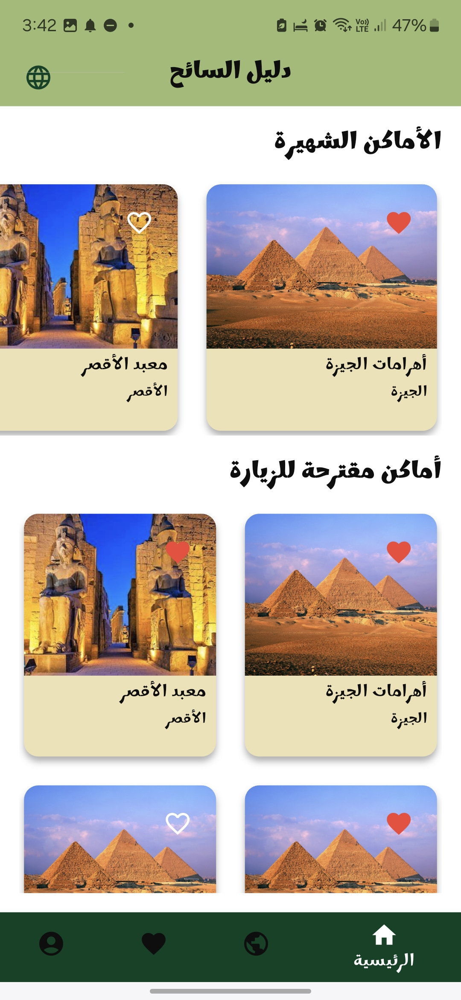
    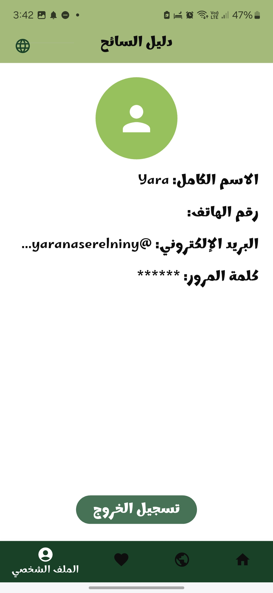

