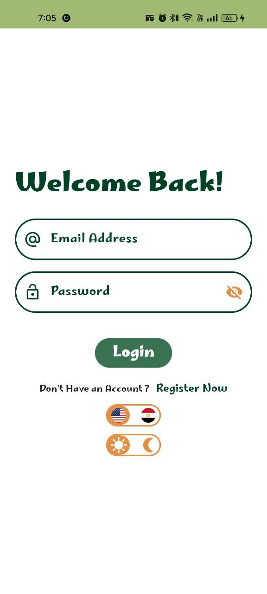
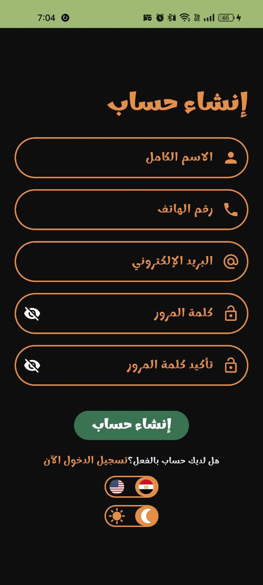
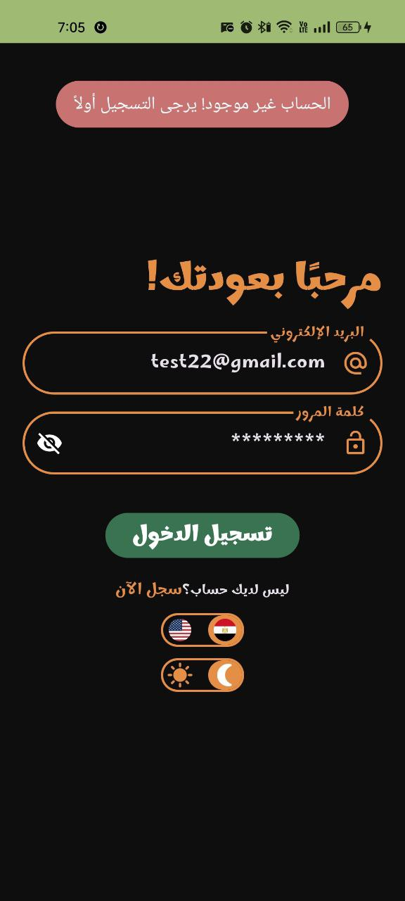

# sprints_tourist_guide_app

A new Flutter project.

## Overview

This project is a mobile application designed for tourists visiting Egypt. The app helps users explore landmarks, museums, and attractions across various Egyptian governorates, providing a user-friendly interface and engaging features. Different states of the app are managed using Bloc State Management.

## Features

1. Authentication

   - Signup Page:

     Input fields: Full Name, Email, Password, Phone Number (optional).  
      A "Signup" button navigates to the Login Page.

   - Login Page:

     Input fields: Email and Password.
     Validatesccessful login.

2. Home Page

   Suggested Places to Visit:
   Displays a grid view of recommended places.
   Popular Places Section:
   Horizontally scrollable cards with:
   Image of the place.
   Name of the place.
   Governorate name.
   A toggleable favorite icon.

3. Governments Page

   A list of three Egyptian governorates.
   Selecting a governorate navigates to a details page showing two landmarks specific to that governorate.

4. Profile Page

   Displays user information:
    - Full Name.
    - Email.
    - Password (hashed for security).
    - Avatar.

   Enable the user to edit his information (Full Name - Phone)  and set avatar.
   Enable the user to toggle between Arabic and English.
   Enable the user to toggle between light and dark mode.

6. Favorites Page

   Displays static cards similar to the "Popular Places" section from the Home Page.

7. Navigation

   Bottom Navigation Bar visible on all main pages:
   Includes icons for Home, Governments, Favorites, and Profile.

8. Page Navigation Animations

   Smooth animations when transitioning between pages.

## Dependencies

1. fluttertoast: ^8.2.10
2. easy_localization: ^3.0.7
3. country_flags: ^3.2.0
4. provider: ^6.1.2
5. lottie: ^3.3.0
6. shared_preferences: ^2.3.5
7. cupertino_icons: ^1.0.8
8. animated_toggle_switch: ^0.8.4
9. flutter_bloc: ^9.0.0
10. bloc: ^9.0.0
11. meta: ^1.15.0
12. skeletonizer: ^1.4.3
13. cached_network_image: ^3.4.1
14. internet_connection_checker: ^3.0.1
15. shimmer: ^3.0.0
16. dio: ^5.7.0
17. image_picker: ^1.1.2

## 📸 Screens
 
 App 0.0.1

 

    
    
    
    
 

 

    
    
    
    
 

 

    
    
    
    
 

 
 App 0.0.2

    
   

     
     
     
     
     
     
   

   light mode
   

     
     
     
     
     
     
   

   dark mode
   

     
     
     
     
     
     
   

   edit user info
   

     
     
     
     
     
     
   

   auth messages / loading
   

     
     
     
     
     
     
   

