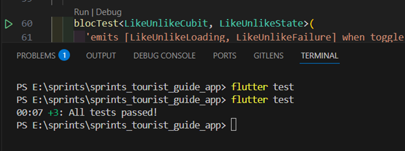

# sprints_tourist_guide_app

A new Flutter project.

## Overview

This project is a mobile application designed for tourists visiting Egypt. The app helps users explore landmarks, museums, and attractions across various Egyptian governorates, providing a user-friendly interface and engaging features. Different states of the app are managed using Bloc State Management.

## Features

1. Authentication

   - Signup Page:

     Input fields: Full Name, Email, Password, Phone Number (optional).  
      A "Signup" button navigates to the Login Page.

   - Login Page:

     Input fields: Email and Password.
     Validatesccessful login.

2. Home Page

   Suggested Places to Visit:
   Displays a grid view of recommended places.
   Popular Places Section:
   Horizontally scrollable cards with:
   Image of the place.
   Name of the place.
   Governorate name.
   A toggleable favorite icon.

3. Governments Page

   A list of three Egyptian governorates.
   Selecting a governorate navigates to a details page showing two landmarks specific to that governorate.

4. Profile Page

   Displays user information:

   - Full Name.
   - Email.
   - Password (hashed for security).
   - Avatar.

   Enable the user to edit his information (Full Name - Phone) and set avatar.
   Enable the user to toggle between Arabic and English.
   Enable the user to toggle between light and dark mode.

5. Favorites Page

   Displays static cards similar to the "Popular Places" section from the Home Page.

6. Navigation

   Bottom Navigation Bar visible on all main pages:
   Includes icons for Home, Governments, Favorites, and Profile.

7. Page Navigation Animations

   Smooth animations when transitioning between pages.

## Dependencies

1. [cupertino_icons](https://api.flutter.dev/flutter/cupertino/cupertino-library.html)
2. [flutter toast](https://pub.dev/packages/fluttertoast)
3. [easy_localization](https://pub.dev/packages/easy_localization)
4. [country_flags](https://pub.dev/packages/country_flags)
5. [lottie](https://pub.dev/packages/lottie)
6. [shared_preferences](https://pub.dev/packages/shared_preferences)
7. [animated_toggle_switch](https://pub.dev/packages/animated_toggle_switch)
8. [flutter_bloc](https://pub.dev/packages/flutter_bloc)
9. [bloc](https://pub.dev/packages/bloc)
10. [meta](https://pub.dev/packages/meta)
11. [cached_network_image](https://pub.dev/packages/cached_network_image)
12. [internet_connection_checker](https://pub.dev/packages/internet_connection_checker)
13. [dio](https://pub.dev/packages/dio)
14. [image_picker](https://pub.dev/packages/image_picker)
15. [firebase_core](https://pub.dev/packages/firebase_core)
16. [firebase_auth](https://pub.dev/packages/firebase_auth)
17. [cloud_firestore](https://pub.dev/packages/cloud_firestore)
18. [dartz](https://pub.dev/packages/dartz)
19. [hive](https://pub.dev/packages/hive)
20. [hive_flutter](https://pub.dev/packages/hive_flutter)
21. [get_it](https://pub.dev/packages/get_it)
22. [path_provider](https://pub.dev/packages/path_provider)
23. [google_maps_flutter](https://pub.dev/packages/google_maps_flutter)

## Dev Dependencies

1. [hive_generator](https://pub.dev/packages/hive_generator)
2. [build_runner](https://pub.dev/packages/build_runner)

## 📸 Screens 0.0.1

 <div style="display: flex; gap: 10px;">
    
    
    
    
 </div>

 <div style="display: flex; gap: 10px;">
    
    
    
    
 </div>

 <div style="display: flex; gap: 10px;">
    
    
    
    
 </div>

## 📸 Screens 0.0.2

 <div style="display: flex; gap: 10px;">
    
    
    
    
    
 </div>

 <div style="display: flex; gap: 10px;">
   
   
   
   
 </div>

 <div style="display: flex; gap: 10px;">
   
   
   
   
 </div>

 <div style="display: flex; gap: 10px;">
   
   
   
   
 </div>

# Unit Testing for LikeUnlikeCubit in Flutter

Unit testing ensures that the `LikeUnlikeCubit` correctly handles the toggling of favorite places. The tests validate:

- The correct state transitions (`Loading`, `Success`, `Failure`).
- The interaction with the `ToggleFavouriteUsecase`.

## Implementation of Unit Tests

### Test Dependencies

The following dependencies were used:

```yaml
flutter_test:
  sdk: flutter
build_runner: ^2.4.14
bloc_test: ^9.1.0
mockito: ^5.4.0
```

### Test Setup

A mock version of `ToggleFavouriteUsecase` was created using Mockito:

```dart
import 'package:flutter_test/flutter_test.dart';
import 'package:mockito/annotations.dart';
import 'package:mockito/mockito.dart';
import 'package:dartz/dartz.dart';
import 'package:sprints_tourist_guide_app/domain/entities/place_entity.dart';
import 'package:sprints_tourist_guide_app/domain/usecase/toggle_favourite_usecase.dart';
import 'package:sprints_tourist_guide_app/presentation/cubit/like_unlike/like_unlike_cubit.dart';
import 'like_unlike_cubit_test.mocks.dart';

@GenerateMocks([ToggleFavouriteUsecase])
void main() {
  late LikeUnlikeCubit cubit;
  late MockToggleFavouriteUsecase mockUsecase;
  late PlaceEntity testPlace;

  setUp(() {
    mockUsecase = MockToggleFavouriteUsecase();
    cubit = LikeUnlikeCubit(mockUsecase);
    testPlace = PlaceEntity(id: '1', name: 'Test Place', likes: []);
  });
```

then rung this command in the terminal to generate the mock using build runner:

```sh
flutter pub run build_runner build --delete-conflicting-output
```

### Test Cases

#### 1. Successful Toggle

```dart
  blocTest<LikeUnlikeCubit, LikeUnlikeState>(
    'emits [LikeUnlikeLoading, LikeUnlikeSuccess] when toggle is successful',
    build: () {
      when(mockUsecase.execute(testPlace)).thenAnswer((_) async => Right(true));
      return cubit;
    },
    act: (cubit) => cubit.toggle(place: testPlace),
    expect: () => [LikeUnlikeLoading(), LikeUnlikeSuccess()],
  );
```

#### 2. Failure Case

```dart
  blocTest<LikeUnlikeCubit, LikeUnlikeState>(
    'emits [LikeUnlikeLoading, LikeUnlikeFailure] when toggle fails',
    build: () {
      when(mockUsecase.execute(testPlace)).thenAnswer((_) async => Left(Failure('Error', 500)));
      return cubit;
    },
    act: (cubit) => cubit.toggle(place: testPlace),
    expect: () => [LikeUnlikeLoading(), LikeUnlikeFailure('Error 500')],
  );
```

## Issues Faced

1. **Undefined Name 'main' Error**

   - Cause: Test files were missing a `main()` function.
   - Solution: We deleted the default widet test instead of comment all the content of the file.

2. **State Comparison Issue**
   - Cause: Expected and actual states were not being recognized as identical.
   - Solution: Implemented `Equatable` in state classes for proper comparison:
   ```dart
   class LikeUnlikeState extends Equatable {
     @override
     List<Object> get props => [];
   }
   ```

## Final Result


